# **Youtube Views Prediction**
#### Author : Althaaf Athaayaa Daffa Qushayyizidane


## **About Dataset**

> Context: 

#### Salah satu implementasi regresi yang dapat dilakukan adalah dengan melakukan prediksi views pada video youtube dengan menggunakan angka statistik atau atribut lain pada videonya. Data statistik ada pada file `youtube_statistics.xlsx.`
<br>
<br>
<br>

## **Definition of Each Column**

|Kolom|Definisi|
|:-:|:-:|
|`trending_date`|tanggal ketika video trending|
|`title`|judul video|
|`channel_title`|nama channel|
|`category_id`|kategori video dalam label encoding|
|`publish_time`|waktu publish video|
|`tags`|tag yang digunakan pada video|
|`views`|jumlah views video|
|`likes`|jumlah likes video|
|`dislikes`|jumlah dislikes video|
|`comment_count`|jumlah komentar pada video|
|`comments_disabled`|apakah status komentar dinonaktifkan pada video|
|`ratings_disabled`|apakah rating dinonaktifkan pada video|
|`video_error_or_removed`|apakah video error atau sudah dihapus saat ini|
|`description`|deskripsi video|
|`No_tags`|jumlah tags yang digunakan|
|`desc_len`|panjang kata deskripsi video|
|`len_title`|panjang kata judul video|
|`publish_date`|tanggal publish video|
<br>
<br>
<br>

## **Steps**

- #### Melakukan EDA dan preprocessing sederhana
    * Jelaskan Fitur mana yang sebaiknya digunakan dari hasil EDA?

- #### Melakukan Feature Engineering 
    * Apakah ada feature tambahan lain yang mendukung? Jelaskan mengapa menggunakan feature tersebut.

- #### Lakukan training model & prediksi views sebagai variabel target
    * Dapat menggunakan model linear regression ataupun algoritma lainnya
    * Lakukan tuning hyperparameter, cari mana model yang paling baik 

- #### Evaluasi model dengan metrics RMSE dan R2
    * Jelaskan & berikan analisis mengapa memilih model tersebut sebagai model akhir yang digunakan.
<br>
<br>
<br>

# **Getting Started**

## **Import Library**

```sh
import warnings
warnings.filterwarnings('ignore')

import numpy as np
import pandas as pd
import seaborn as sns
from scipy import stats
from scipy.stats import uniform
import matplotlib.pyplot as plt
from matplotlib import rcParams
%matplotlib inline
from sklearn.preprocessing import MinMaxScaler, StandardScaler

from sklearn.metrics import mean_squared_error, r2_score
from sklearn.model_selection import train_test_split,RandomizedSearchCV
from sklearn.linear_model import LinearRegression, Ridge, Lasso, ElasticNet
from sklearn.tree import DecisionTreeRegressor
from sklearn.ensemble import RandomForestRegressor
from sklearn.svm import SVR
import pickle
from sklearn.model_selection import train_test_split
from sklearn.linear_model import LinearRegression, Ridge, Lasso, ElasticNet
from sklearn.preprocessing import RobustScaler
from xgboost import XGBRegressor, XGBClassifier
from xgboost import plot_importance

import gdown

print('numpy version : ',np.__version__)
print('pandas version : ',pd.__version__)
print('seaborn version : ',sns.__version__)
```
<br>
<br>
<br>

## **Load Data**

```sh
df = pd.read_excel("youtube_statistics.xlsx")
df.sample(5)
```

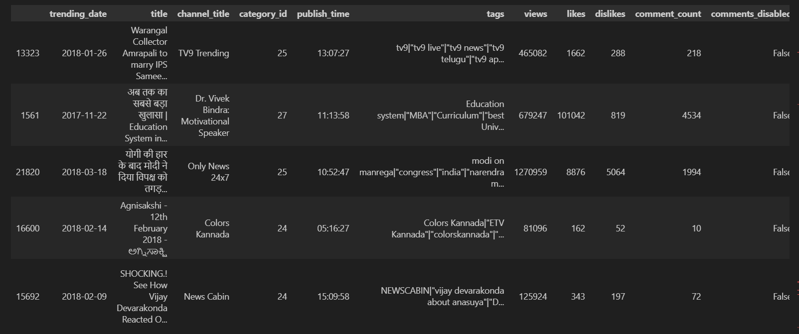
<br>
<br>
<br>

## **Exploratory Data Analysis (EDA)**

### Descriptive Statistic

```sh
print(df.isnull().values.any())
print(df.isna().sum())
```

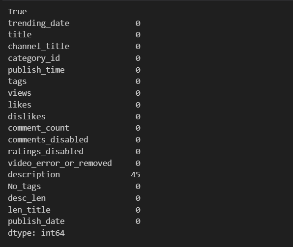

#### Terdapat 1 kolom missing value yaitu kolom **'description'** sejumlah 45 baris.
<br>
<br>
<br>

```sh
df.info()
```
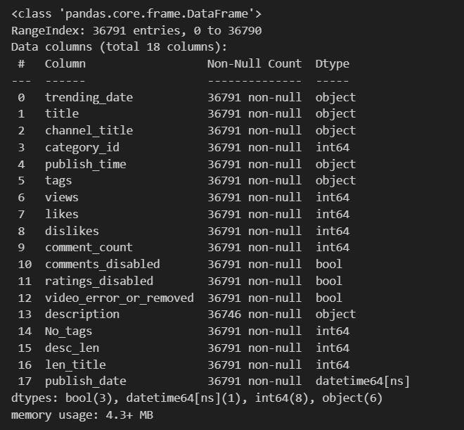

* #### Dataframe terdiri dari 18 kolom dan 36791 baris.
* #### Dataframe memiliki 9 kategorikal kolom, 1 datetime, dan 8 numerikal.
* #### Kolom ***'views'*** adalah target dari dataset.
* #### Terdapat kesalahan data tipe di kolom 'trending_date' yang seharusnya merupakan datetime.
<br>
<br>
<br>

### Grouping Columns by Type

```sh
nums = ['int64', 'int32', 'int16', 'float64', 'float32', 'float16']
nums = df.select_dtypes(include=nums)
nums = nums.columns

cats = ['object','bool']
cats = df.select_dtypes(include=cats)
cats = cats.columns

timestamp = ['publish_date']
```
<br>
<br>
<br>

### Univariate Analysis

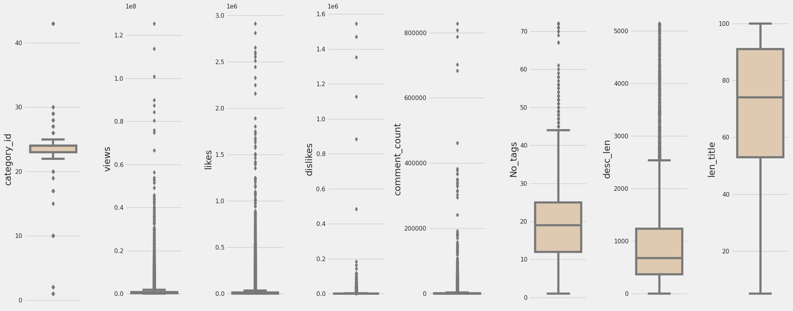

*   #### category_id: Distribusi normal, terdapat outliers di atas batas atas dan di bawah batas bawah
*   #### views: terdapat outliers diatas batas atas.
*   #### likes: terdapat outliers diatas batas atas.
*   #### dislikes: terdapat outliers diatas batas atas.
*   #### comment_count: terdapat outliers diatas batas atas.
*   #### No_tags: cenderung *positive skewed*, terdapat outliers diatas batas atas.
*   #### desc_len: cenderung *positive skewed*, terdapat outliers diatas batas atas.
*   #### len_title: cenderung *negative skewed*.\
<br>
<br>
<br>

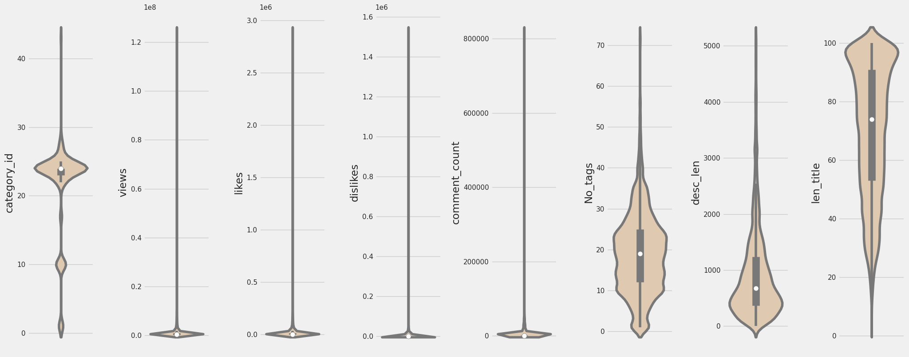

*   #### category_id: distribusi value banyak di antara 20 - 30.
*   #### views: ditstribusi value banyak di 0 - 10.000.000.
*   #### likes: ditstribusi value banyak di 0 - 100.000.
*   #### dislikes: ditstribusi value banyak di 0 - 100.000.
*   #### comment_count: ditstribusi value banyak di 0 - 5000.
*   #### No_tags: distribusi value banyak di antara 10 - 25.
*   #### desc_len: ditstribusi value banyak di bawah 1000.
*   #### len_title: ditstribusi value banyak di atas 90.
<br>
<br>
<br>

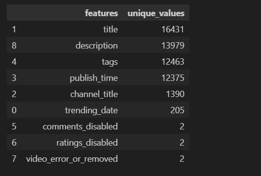

* #### Features `'trending_date'`, `'title'`, `'channel_title'`, `'publish_time'`, `'tags'`, `'description'` merupakan data non kategorikal (non-linear) memiliki value unique yang sangat banyak sehingga features ini tidak dianjurkan untuk digunakan sebagai features modelling, karena hal ini dapat menyebabkan model terlalu sensitive dan menyebabkan *overfitting*.
* #### Features `'comments_disabled'`, `'ratings_disabled'`, `'video_error_or_removed'` merupakan data non-linear yang memiliki 2 value unique dimana merepresentasikan suatu boolean (bimodal).
<br>
<br>
<br>

### **Multivariate Analysis**

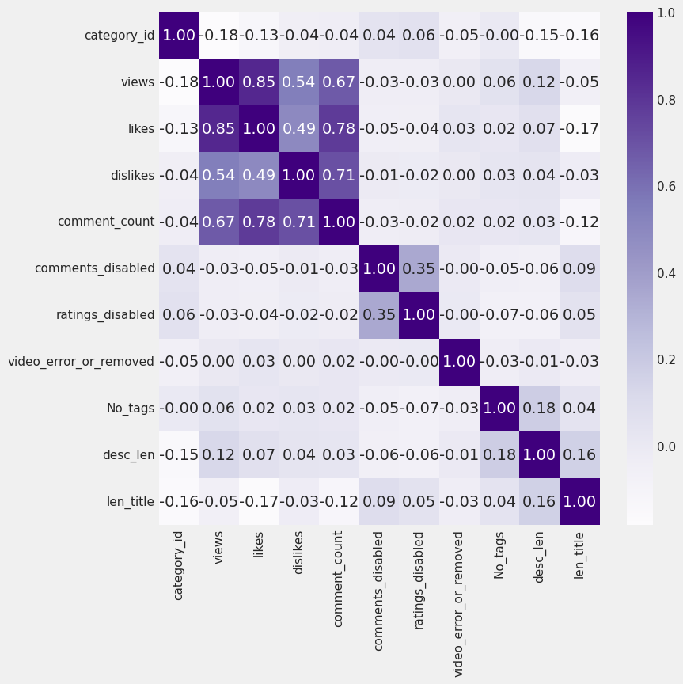

Target = views

*   #### category_id: -0.18, korelasi *negative* namun hampir tidak memiliki korelasi. **Nomor ID kecil lebih memiliki banyak views**.
*   #### likes: 0.85, korelasi *highly positive*. **Semakin banyak likes semakin banyak views**.
*   #### dislikes: 0.54, korelasi *low positive*. **Semakin banyak dislikes semakin banyak views**.
*   #### comment_count: 0.67, korelasi *low positive*. **Semakin banyak comment_count semakin banyak views**
*   #### comment_disabled: -0.03, korelasi *negative* namun sangat lemah hampir tidak memiliki korelasi sama sekali. **Jika comment di disable cenderung sedikit views**.
*   #### ratings_disabled: -0.03, korelasi *negative* namun sangat lemah hampir tidak memiliki korelasi sama sekali. **Jika ratings di disable cenderung sedikit views**,
*   #### video_error_or_removed: 0.00, sama sekali tidak memiliki korelasi.
*   #### No_tags: 0.06, korelasi *positive* hampir tidak memiliki korelasi sama sekali. **Semakin tinggi No_tags semakin banyak views**.
*   #### desc_len: 0.12, korelasi *positive* namun sangat lemah. **Semakin panjang deskripsi semakin banyak views**.
*   #### len_title: -0.05, korelasi *negative* namun sangat lemah hampir tidak memiliki korelasi sama sekali. **Semakin panjang judul, semakin views sedikit**.
* **Antara dislikes dan comment_counts merupakan data redundant (0,71) sebaiknya dihapus salah satu.**
<br>
<br>
<br>

## **Data Pre-Processing**

### Handling Missing value

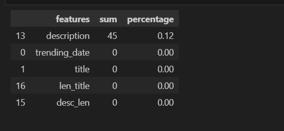

#### Meskipun hanya terdapat 0,12% missing values dikarena kolom yang memiliki missing value merupakan kolom kategorikal yang memiliki unique values yang sangat banyak dimana fitur ini dapat menyebabkan ***high variance*** dalam model sehingga dibandingkan melakukan drop missing value, dilakukan drop kolom `description`.

```sh
df = df.drop(['description'],axis=1)
```
<br>
<br>
<br>

### Handling Duplicate Values

```sh
df.duplicated().sum()

4229
```


```sh
df.drop_duplicates(inplace=True)
```


```sh
df.duplicated().sum()

0
```

* #### Dari pemeriksaan data duplikasi dimana terdapat 4229 duplikasi, lalu dilakukan drop_duplicates()
<br>
<br>
<br>

### Handling Outliers


#### Dari grafik yang kita keluarkan ketika EDA, kita tahu bahwa hampir ada empat kolom numerik memiliki outlier. Sebelum kita mengeluarkan outlier, karena kita tahu bahwa bentuk distribusi kolom-kolom ini condong ke kiri, kita coba normalkan dengan `log transformation` kecuali untuk kolom `category_id`,`len_tittle` (data bukan right skewed)

```sh
right_skew = ['likes','dislikes','comment_count','desc_len','No_tags','views']
```


```sh
for num in right_skew:
    df['log_'+num] = np.log(df[num] + (df[df[num] > 0][num].min() / 2))
```

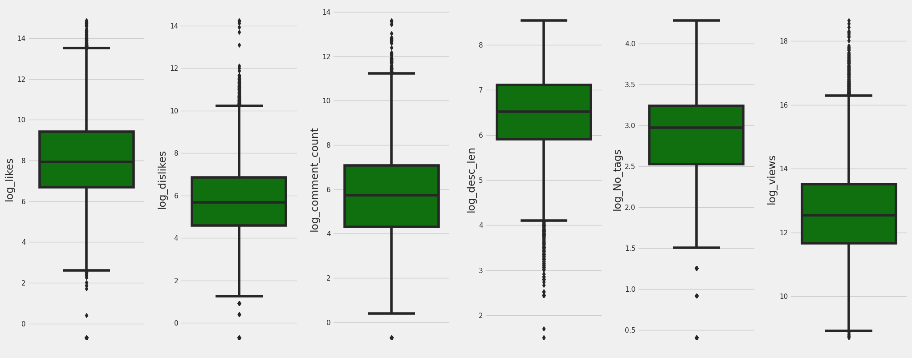

#### Untuk itu maka kita bisa menangani outliers menggunakan z-score.

```sh
print("Jumlah data sebelum menghapus outliers: ", len(df))

for num in right_skew:
  z_scores = np.abs(stats.zscore(df[num]))
  df = df[z_scores <= 3]

print("Jumlah data setelah menghapus outliers: ", len(df))


Jumlah data sebelum menghapus outliers:  32562
Jumlah data setelah menghapus outliers:  30447
```

#### Setelah dilakukan penghapusan outliers menggunakan z-score, **terhapus total 2115 data**.
<br>
<br>
<br>

### Normalization/Standardization/Log Transformation

#### Melakukan *Soft Feature Scaling* dengan menggunakan Standardization untuk melakukan normalisasi data ke seluruh kolom numerik data setelah dilakukan ***Feature Engineering***.
<br>

### Feature Encoding

#### Mengubah `publish_date` dan `trending_date` ke nama hari dalam 1 minggu lalu mengkonversinya ke angka dari 0 - 6 untuk memudahkan kerja machine learning.

```sh
df['trending_day'] = pd.to_datetime(df['trending_date']).dt.day_name()


day_map = {'Sunday':0,'Monday':1,'Tuesday':2,'Wednesday':3,'Thursday':4,'Friday':5,'Saturday':6}


df['trending_day'] = df['trending_day'].map(day_map)


df['publish_day'] = pd.to_datetime(df['publish_date']).dt.day_name()


df['publish_day'] = df['publish_day'].map(day_map)
```


#### Mengubah kolom dengan datatype bool ke int agar lebih mudah diproses oleh model.

```sh
df['comments_disabled'] = df['comments_disabled'].astype(int)
df['ratings_disabled'] = df['ratings_disabled'].astype(int)
df['video_error_or_removed'] = df['video_error_or_removed'].astype(int)
```


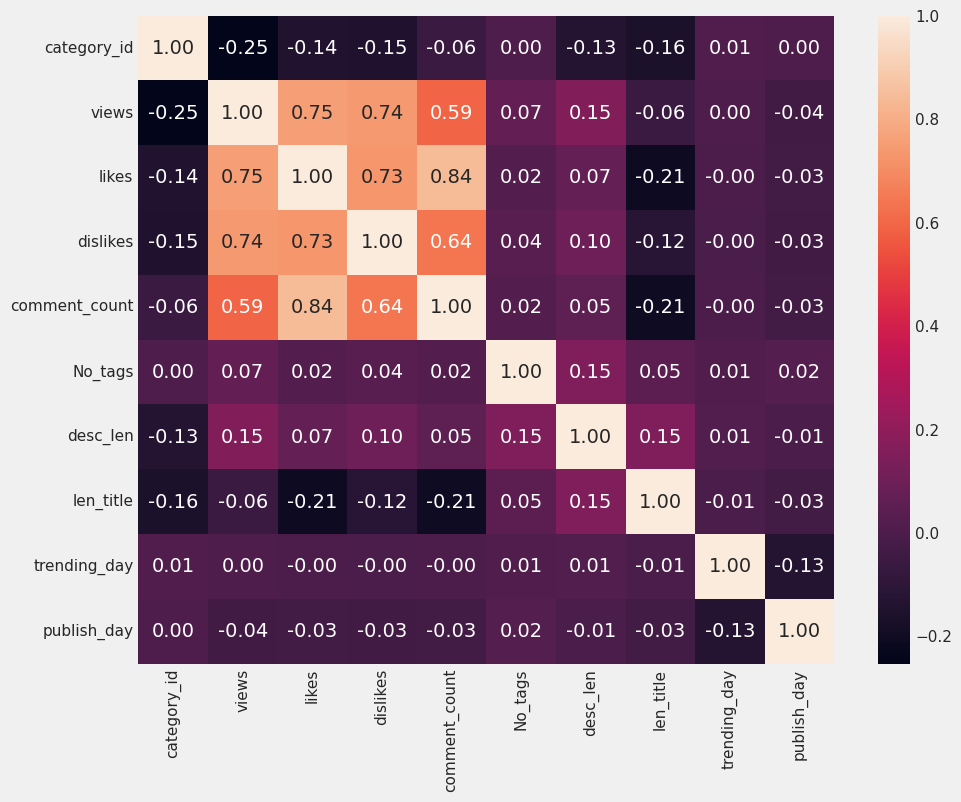

* #### Dapat dilihat bahwa `trending_day`, `publish_day`, dll. (semua yang memiliki korelasi sangat rendah baik negative maupun positive) tidak memiliki korelasi dengan target.
* #### Sehingga dapat disimpulkan bahwa feature yang memiliki korelasi kuat dengan `views` adalah `likes`, `dislikes`, `comment_count`. Namun karena terdapat multikoleniaritas feature `comment_count` harus dihapuskan.
<br>
<br>
<br>

### Class Imbalance

* #### Tidak dilakukan oversampling maupun undersampling untuk dataset ini dikarenakan model yang ini merupakan model regresi, dimana model regresi adalah prediksi nilai kontinu dengan skala yang tidak menentu yang tidak dipengaruhi oleh mayoritas/minoritas data.
<br>

### Kesimpulan 

#### Dari hasil EDA features yang sebaiknya digunakan meliputi `'category_id'`, `'likes'`, `'dislikes'`, `'No_tags'`, `'desc_len'`, `'len_title'` untuk memprediksi views setelah dilakukan transformasi (scaling) di ***feature engineering***.
<br>
<br>
<br>

### Feature Engineering

```sh
# Membuat kolom yang menunjukan trending dengan jumlah likes dan jumlah comment (comment_count)
df['trending'] = df['likes'] + df['comment_count']


# Membuat kolom yang menunjukan video paling disukai dengan jumlah likes
df['most_liked'] = df['likes'] >=200

# Membuat kolom jam menjadi 1 - 24 tanpa menit dan detik.
df['publish_hour'] = pd.to_datetime(df['publish_time']).dt.round("H").dt.strftime("%H").astype(int)

df.head()
```
<br>
<br>
<br>

### Transformation

```sh
from scipy.stats import boxcox
new_nml = ['category_id','views','likes','dislikes','comment_count','No_tags','desc_len','len_title','trending_day','publish_day','most_liked','trending', 'publish_hour']

for num in new_nml:
    df['nml_'+num],_ = boxcox(df[num]+1)
```


```sh
nums_nml = ['nml_category_id', 'nml_views', 'nml_likes', 'nml_dislikes', 'nml_comment_count', 'nml_No_tags', 'nml_desc_len', 'nml_len_title','nml_most_liked','nml_trending', 'nml_publish_hour']
```


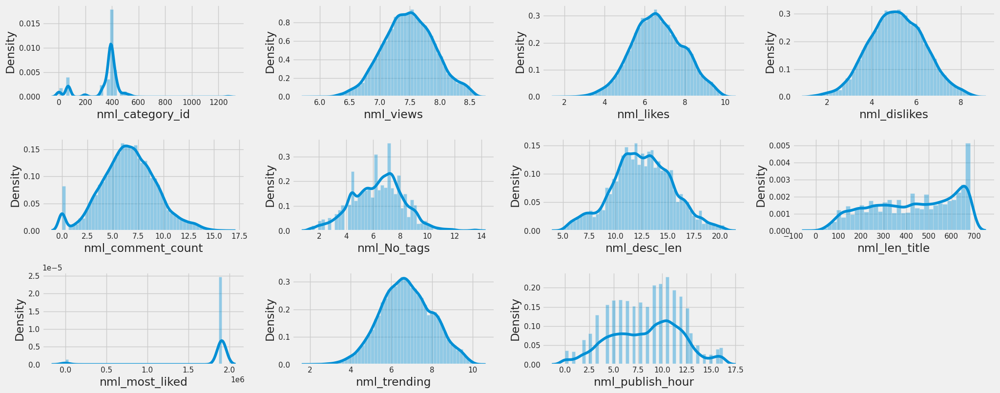
<br>
<br>
<br>

## **Training Model & Views Prediction**

```sh
from sklearn.model_selection import train_test_split
from sklearn.linear_model import LinearRegression, Ridge, Lasso, ElasticNet
from sklearn.tree import DecisionTreeRegressor
from sklearn.ensemble import RandomForestRegressor
from sklearn.svm import SVR
from sklearn.preprocessing import RobustScaler
from xgboost import XGBRegressor, XGBClassifier
from xgboost import plot_importance
```


```sh
# Kolom target yang ingin diprediksi adalah 'nml_views'
x = df[['nml_category_id', 'nml_likes', 'nml_dislikes', 'nml_comment_count', 'nml_No_tags', 'nml_desc_len', 'nml_len_title', 'nml_most_liked', 'nml_trending', 'publish_hour']]
y = df['nml_views']

# Pisahkan data menjadi data pelatihan dan data pengujian
x_train, x_test, y_train, y_test = train_test_split(x, y, test_size=0.2, random_state=42)

# buat train and test dataset
data_train = pd.concat([x_train, y_train], axis=1)
data_test  = pd.concat([x_test, y_test], axis=1)

# Standardize the data
scaler    = RobustScaler()
scaler.fit(data_train)
std_train = scaler.transform(data_train)
std_test  = scaler.transform(data_test)

# Turn into data frame
std_train = pd.DataFrame(std_train, columns=data_train.columns)
std_test  = pd.DataFrame(std_test, columns=data_test.columns)

# Re-split the data
xtrain_std = std_train.drop("nml_views", axis=1)
ytrain_std = std_train.nml_views
xtest_std  = std_test.drop("nml_views", axis=1)
ytest_std  = std_test.nml_views
```


```sh
from sklearn.metrics import mean_squared_error, mean_absolute_error, r2_score
def eval_regression(y_test, pred):
    print("MAE: %.2f" % mean_absolute_error(y_test, pred)) # The MAE
    print("RMSE: %.2f" % mean_squared_error(y_test, pred, squared=False)) # The RMSE
    print('R2 score: %.2f' % r2_score(y_test, pred)) # Explained variance score: 1 is perfect prediction

def show_best_hyperparameter(model, hyperparameters):
    for key, value in hyperparameters.items() :
        print('Best '+key+':', model.get_params()[key])

def show_feature_importance(model):
    feat_importances = pd.Series(model.feature_importances_, index=x.columns)
    ax = feat_importances.nlargest(25).plot(kind='barh', figsize=(10, 8))
    ax.invert_yaxis()

    plt.xlabel('score')
    plt.ylabel('feature')
    plt.title('feature importance score')
```


```sh
models = {
    "Linear"     : LinearRegression(n_jobs=-1),
    "Ridge"      : Ridge(),
    "Lasso"      : Lasso(),
    "Elasticnet" : ElasticNet(),
    "DT"         : DecisionTreeRegressor(),
    "RF"         : RandomForestRegressor(n_jobs=-1),
    "SVR"        : SVR(),
    "Xgb"        : XGBRegressor()
}

for model_name, model in models.items():
    model.fit(xtrain_std, ytrain_std)

    print("Evaluate model: {}".format(model_name))
    print('test:')
    y_pred = model.predict(xtest_std)
    print(eval_regression(ytest_std, y_pred), "\n")
    print('train')
    y_pred = model.predict(xtrain_std)
    print(eval_regression(ytrain_std, y_pred), "\n")


    Evaluate model: Linear
test:
MAE: 0.27
RMSE: 0.34
R2 score: 0.79
None 

train
MAE: 0.27
RMSE: 0.34
R2 score: 0.78
None 

Evaluate model: Ridge
test:
MAE: 0.27
RMSE: 0.34
R2 score: 0.79
None 

train
MAE: 0.27
RMSE: 0.34
R2 score: 0.78
None 

Evaluate model: Lasso
test:
MAE: 0.55
RMSE: 0.68
R2 score: 0.13
None 

train
MAE: 0.54
RMSE: 0.68
R2 score: 0.13
None 

Evaluate model: Elasticnet
test:
MAE: 0.54
RMSE: 0.67
R2 score: 0.16
None 

train
MAE: 0.54
RMSE: 0.67
R2 score: 0.16
None 

Evaluate model: DT
test:
MAE: 0.24
RMSE: 0.35
R2 score: 0.77
None 

train
MAE: 0.00
RMSE: 0.00
R2 score: 1.00
None 

Evaluate model: RF
test:
MAE: 0.17
RMSE: 0.24
R2 score: 0.89
None 

train
MAE: 0.06
RMSE: 0.09
R2 score: 0.98
None 

Evaluate model: SVR
test:
MAE: 0.55
RMSE: 0.68
R2 score: 0.13
None 

train
MAE: 0.54
RMSE: 0.68
R2 score: 0.13
None 

Evaluate model: Xgb
test:
MAE: 0.18
RMSE: 0.24
R2 score: 0.89
None 

train
MAE: 0.14
RMSE: 0.19
R2 score: 0.93
None 
```
